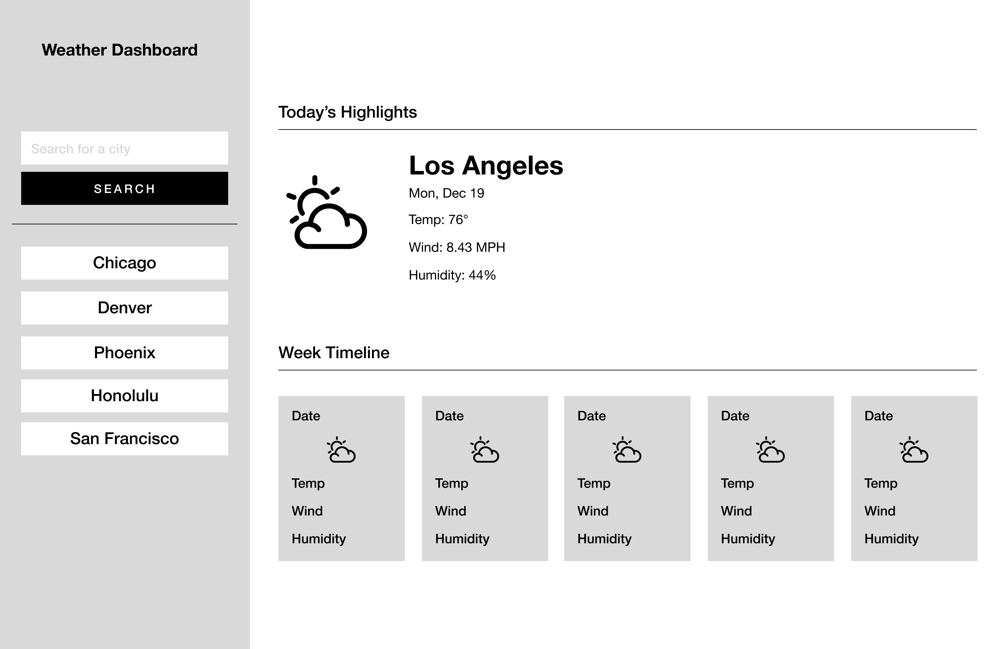

# Weather-Dashboard

## Project Scope

Create a weather application using a third-party API. This application runs in the browser and features dynamically updated HTML, CSS, and Bootstrap CSS framework. Using the 5 Day Weather Forecast, https://openweathermap.org/forecast5, to retrieve date, temperature, wind speed, humidity, and weather icon for the current day and five day forecast for selected location.

The weather dashboard has a form input where the user can search desired city. Once presented with the city, the application posts current conditions and a five day forecast for that city. The searched cities stay in local storage and are added to the search history.

## Installation

Visit https://rachelwildberger.github.io/Weather-Dashboard/ to view the most current weather dashboard. 

## Work in progress

This project is not fully complete. 

- need to create new function allowing week timeline to traverse objects through html
- access weather icons
- refine the city search section to display cities properly and have the saved city data on each button list item

## Credits

Open Weather App - https://openweathermap.org/

Bootstrap - https://getbootstrap.com/

Collaborators include class TA Joey Brown and tutor Carlin Shaw.

## License

N/A
